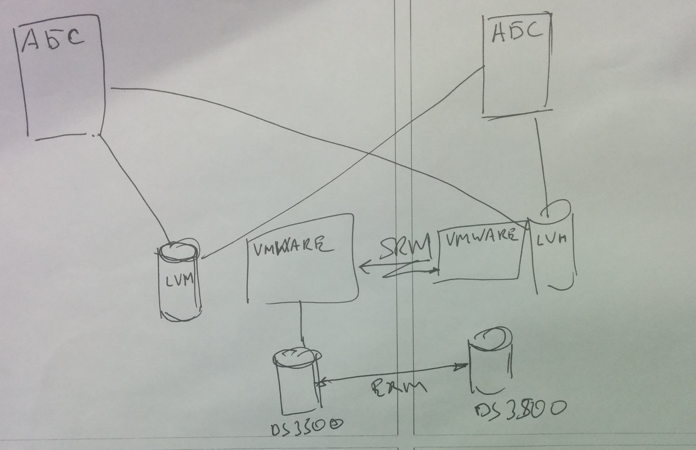
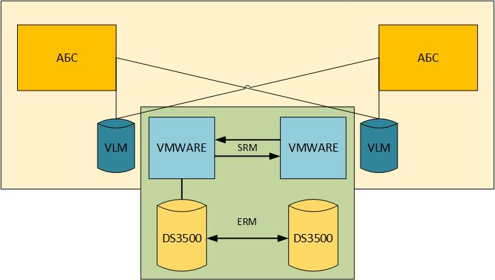

**_Задание 2:_** *3. Оформите составленную инженером схему для включения в состав проектной документации (используйте инструмент MS Visio).*

Оформленная схема.
Я выделила элементы в условные группы, исходя из их предполагаемой работы.

